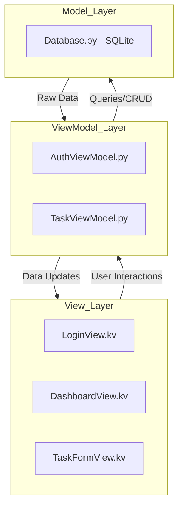
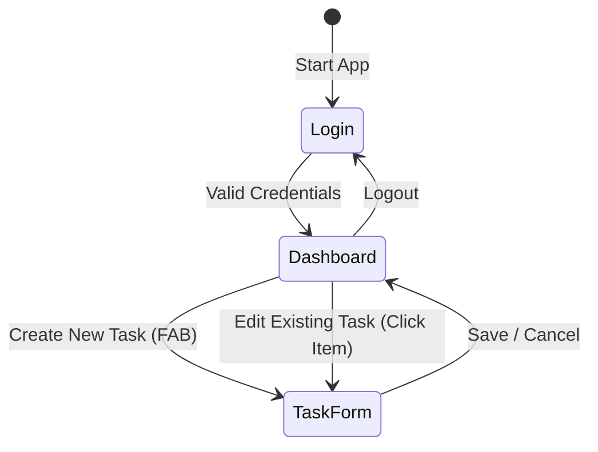

# Smart Student Planner - Design Documentation

## 1. App Purpose and Target Users
The **Smart Student Planner** is a high-productivity mobile application designed specifically for students in higher education. Its primary goal is to centralize academic tasks, deadlines, and module-specific notes into a single, intuitive interface.

**Target Users:**
- University students managing multiple course modules.
- Distance learners needing strict deadline tracking.
- Any student looking to improve time management through a "Smart" digital planner.

## 2. Architecture Overview (MVVM)
To ensure the code is maintainable, scalable, and follows professional development standards, the application implements the **Model-View-ViewModel (MVVM)** design pattern.

### Why MVVM?
- **Separation of Concerns**: UI code (Kivy) is entirely decoupled from business logic and database management.
- **Data Binding**: Kivy's property system acts as the binder between the View and ViewModel.
- **Testability**: Business logic in ViewModels can be tested independently of the graphical user interface.

### Architecture Breakdown:

## 3. Navigation Flow Diagram
The application follows a simple, secure, and user-friendly navigation flow.

## 4. Technical Implementation
- **Framework**: Kivy + KivyMD (Targeting Android/iOS).
- **Persistence**: SQLite (Local SQL database for data integrity).
- **Styling**: Material Design 3 (Deep Purple theme).
- **Validation**: All form inputs are validated in the `TaskViewModel` before persistence.
